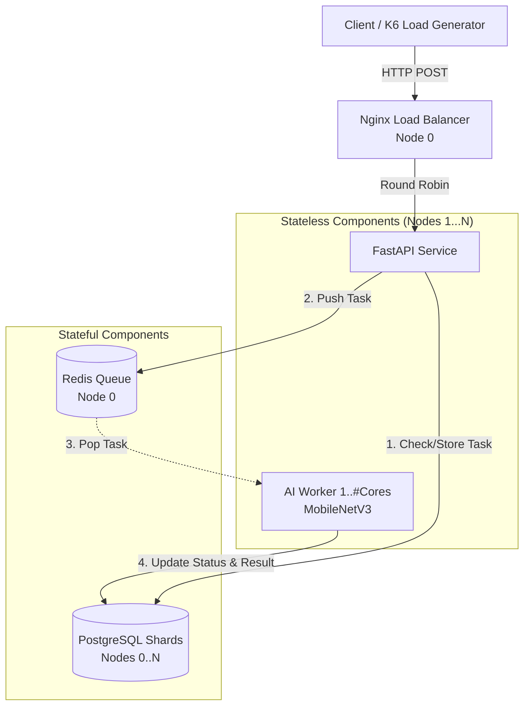
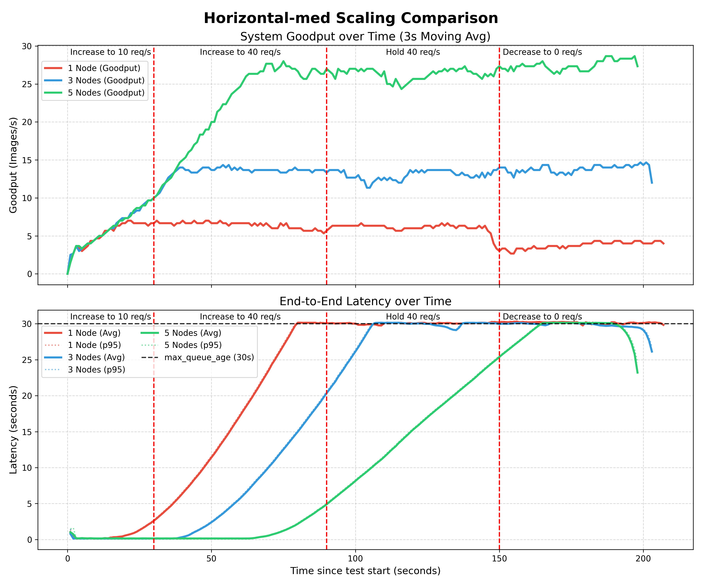
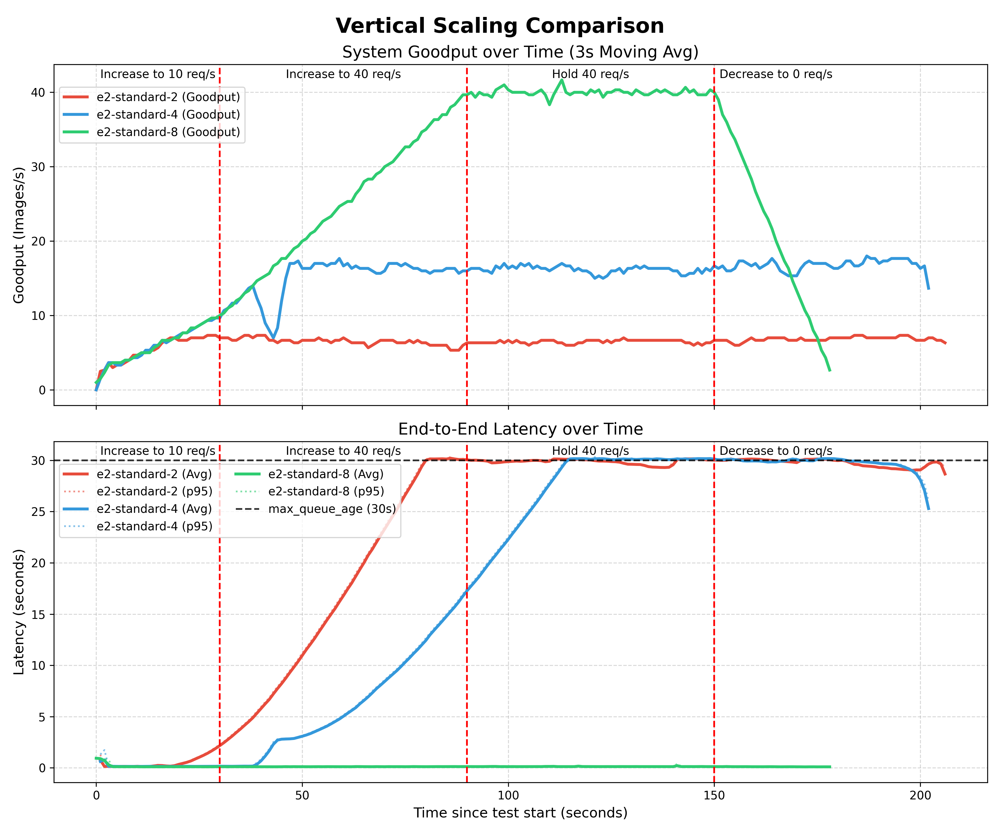
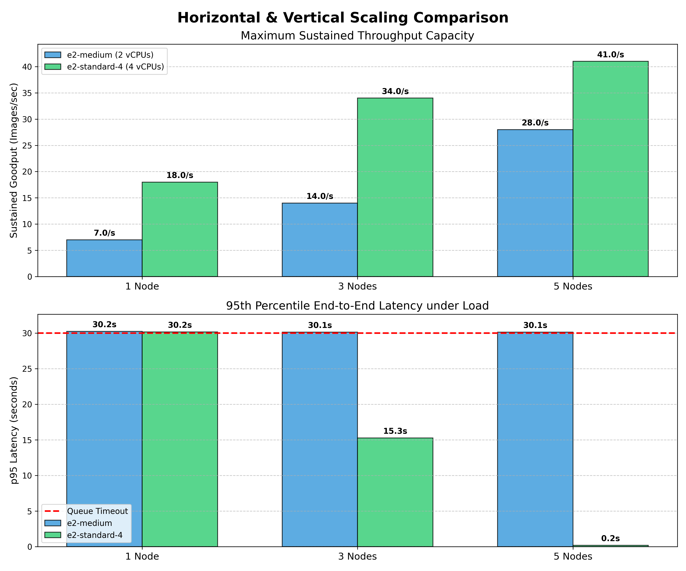

# Scalability Engineering: AI Image Classification System

**Authors:** Gökay Sengün, Lorenz Pusch  
**Context:** Prototyping Assignment, Scalability Engineering (Summer Semester 2026)  
**Note:** Code in this project was developed with the assistance of LLMs

This repository contains the complete infrastructure as code, application code, evaluation scripts, results and slides of the talk.

The project follows the principles from the Scalability Engineering lectures and best practices from the Amazon Builders' Library (e.g., Load Shedding, Backpressure, Idempotency, and Deterministic Jitter).

Our project implements an AI Image Classification System. The user sends an image as URL and the system will then classify it using MobileNetV3 from Tensorflow. The result (class of the image, e.g. dog / cat) is stored in the Database and can be queried.

---

## 1. Application Architecture

Our system separates stateless computation from stateful storage components. 

### Architecture Diagram



*   **Stateless Components:** The `API` (FastAPI) and the `AI Worker` (Python/TensorFlow) hold no state. The API asynchronously accepts requests and the workers process images from the queue. For more details about how this scales see [Scaling Horizontal and Vertical](#scaling-horizontal-and-vertical).
*   **Stateful Components:** The `Redis` queue manages the backlog of tasks. `PostgreSQL` stores the metadata and classification results. 
*   **Sharding:** To avoid a database bottleneck, PostgreSQL is sharded across all available nodes (key-based sharding). The API and Worker route to a specific database shard by hashing the `task_id` (`hash(task_id) % NUMBER_OF_DBS`).

---

## 2. Strategies for High Load

To handle massive traffic without crashing, we implemented multiple mitigation strategies directly into our code.

### Strategy 1: Load Shedding & Multi-Tenant Fairness
We implemented a custom FastAPI middleware that enforces strict concurrency limits. It utilizes **Load Shedding** to reject excess requests with an `HTTP 503` (or `429`) instantly, protecting the server from Resource Exhaustion. It also enforces **Multi-Tenant Fairness** by assigning soft and hard burst limits based on the `X-Client-ID` header.

```python
# from app/api/main.py
CLIENT_SOFT_LIMIT         = GLOBAL_MAX_REQUESTS * 0.2
CLIENT_BURST_LIMIT        = GLOBAL_MAX_REQUESTS * 0.5
GLOBAL_THROTTLE_THRESHOLD = GLOBAL_MAX_REQUESTS * 0.8

if client_count >= CLIENT_BURST_LIMIT:
    return Response(content="Client burst quota exceeded.", status_code=429)

if client_count >= CLIENT_SOFT_LIMIT and active_requests >= GLOBAL_THROTTLE_THRESHOLD:
    return Response(content="System under heavy load. Client soft quota exceeded.", status_code=429)
```

### Strategy 2: Backpressure
According to Little's Law ($L = \lambda \times W$), an insurmountable queue backlog leads to wasted work. Thats why the API refuses to enqueue new images if the Redis queue exceeds `MAX_GLOBAL_QUEUE_SIZE`. According to the Law we calculate the queue size as follows:

```sh
# from infra/startup.sh.tpl
MAX_GLOBAL_QUEUE_SIZE=$(( THROUGHPUT * MAX_QUEUE_AGE * NUM_WORKER))
```
where THROUGHPUT is the speed at which a worker node processes images per second, and NUM_WORKER is the number of worker-nodes. If the queue size is reached, new tasks are rejected.
```python
# from from app/api/main.py
if queue_length >= MAX_QUEUE_SIZE:
   return Response(content="Queue is full. Please retry later.", status_code=503)
```
Additionally, the worker evaluates `AgeOfFirstAttempt`: if a task has been waiting in the queue for more than `MAX_QUEUE_AGE_SECONDS` (e.g., 30s), it is instantly dropped without wasting CPU on AI inference.

### Strategy 3: Safe Retries via Idempotent APIs
If a client encounters a load-shedding response (503/429), it retries the request using Exponential Backoff & Jitter. To make these retries safe, the client provides a unique `task_id`. If we find that the same ID is already in the DB the API returns a semantically equivalent response without duplicating the task in the queue.

### Strategy 4: Deterministic Jitter on Startup
To prevent a "thundering herd" of database connections upon cluster startup, the API applies a deterministic jitter based on its hostname.

---

## 3. Scaling Process

### Scaling Horizontal and Vertical
*   **Horizontal:**  Running `terraform apply` it will be asked how many nodes/VMs should be provisioned. The startup script automatically does the scaling. As shown in the [Architecture Diagram](#architecture-diagram) above, we use the following mechanism when more then one node is provisioned:
	* *The Loadbalancer and Redis* do not scale/replicate and stay always on Node 0. But the MAX_GLOBAL_QUEUE_SIZE is dynamic and increases with the number of Nodes
	* *The PostgresSQL DB* gets sharded over every node. We compute the DB index for each request based on the id's hash.
    ```python
    digest = hashlib.sha256(task_id.bytes).digest()
    return int.from_bytes(digest, "big") % NUMBER_OF_DBS
    ```
	* *The API and AIWorker* get scaled on every node except Node 0 in order to provide Node 0 enough compute power for large horizontal scales
    ```sh
    # from infra/startup.sh.tpl
    echo "Node $NODE_INDEX: Starting Postgres on EVERY node"
    start_postgres
    
    if [ "$CLUSTER_SIZE" = "1" ]; then
	    echo "Starting single-node deployment"
	    start_loadbalancer_and_redis
	    start_stateless
    elif [ "$NODE_INDEX" = "0" ]; then
	    echo "Node 0 (Multi-Node): Starting Loadbalancer & Redis ONLY (No API/Worker)"
	    start_loadbalancer_and_redis
    else
	    echo "Node $NODE_INDEX (Multi-Node): Starting Stateless (API & Worker)"
	    start_stateless
    fi
    ```
*   **Vertical:** Changing `machine_type` (e.g., from `e2-medium` to `e2-standard-4`) allocates more CPU cores. Our `startup.sh.tpl` dynamically detects the available cores via `$(nproc)` and spins up the corresponding amount of AI-Worker containers to utilize the available resources more efficient.

	```sh
    # from infra/startup.sh.tpl
	# vertical scaling based on number of cores
	CORES=$(nproc)
	# leave one core for DB/API/Nginx if possible to prevent overload
	AI_WORKERS=$(( CORES > 1 ? CORES - 1 : 1 ))
	```

### Measured Scalability Results
We tracked the **Sustained Goodput** (successfully processed images per second) and the **Avg. and p95 End-to-End Latency** using `k6` using the following stages:
```js
// from k6_load_test.js
stages: [
  { duration: '30s', target: 10 }, // increase fast to 10 Req/s
  { duration: '1m', target: 40 },  // go up to 40 Req/s
  { duration: '1m', target: 40 },  // hold high load for 1 min
  { duration: '30s', target: 0 },  // Cooldown
],
```

We got the following results:


*Figure 1: Horizontal Scaling Comparison (1 vs. 3 vs. 5 Nodes on e2-medium).* 
The Goodput scales clearly as we add nodes. Despite massive overload by the load generator, the p95 latency flattens perfectly at the 30-second mark, proving that our Wasted Work / Backpressure mechanisms successfully prevents the system from entering overloading.


*Figure 2: Vertical Scaling Comparison (e2-standard-2 vs. e2-standard-4 vs. e2-standard-8).*
Our dynamic `nproc` container allocation successfully scales the goodput of a single node proportionally to the available CPU cores. For e2-standard-8 we see that there where enough workers available to clear the queue for this loadtest fast enough to prevent any latency increases.


*Figure 3: Bonus Task - Horizontal Scaling with more performant machines (e2-medium (2 CPUs) vs. e2-standard-4 (4 CPUs))*
The impact of a more performant VM can be clearly seen also when we scale it horizontally. More CPUs directly increase the  Goodput as we scale using `nproc` as metric. On the latency plot we see, that with only one Node, both machine types reach the Queue Timeout, but with more Nodes the benefit of using  e2-standard-4 can be clearly seen.

---

## 4. Limitations

While scalable, our current architecture has known limitations:
1.  **Single Point of Failure (Node 0):** Currently, the Nginx Load Balancer and the Redis Queue strictly reside on Node 0. If Node 0 crashes, the entire system becomes inaccessible. Node 0 is also the only node running the loadbalancer and the redis queue both of which can be a bottleneck at high loads or big cluster sizes.
2.  **Dynamic Scaling:** Our setup does not scale automatically. If you want to scale it, it has to be shutdown first with the consequences of loosing all data in the DBs for now. However, if the data in the DB would survive, our database sharding uses a simple modulo operation (`hash(task_id) % NUMBER_OF_DBS`). If we scale out from 3 to 5 nodes dynamically while tasks are being processed, the hashes will resolve to different databases, leading to "Task Not Found" errors or similar. 
3. **Hyperparameters:** There are some Hyperparameter we set intuitively without any point of reference or test:
	- MAX_API_CAPACITY = 100: Concurrent requests the API can handle
	- DB_MAX_CONN = 20: open DB connections used by the API per db shard
	- THROUGHPUT=$(( CORES * 5 )): The AI-Worker inferences 5 images per core and second (this is somehow also seen in the result-plots)
	- MAX_QUEUE_AGE = 30: Queue Timeout after that the worker will not process the task

---

## 5. Deployment

Our Terraform setup provisions all required GCP resources and starts the application via a startup script. The application consists of multiple components, including our API and AI worker, which are packaged as separate Docker images and launched by the startup script. The Docker images are built automatically by GitHub Actions using the application code from this repository. Additional services, such as the load balancer, Redis queue, and PostgreSQL database, are also run as Docker containers.

---

## 6. Reproducibility Tutorial

Follow these steps to deploy, load-test, and evaluate the system.

### Prerequisites
* Google Cloud CLI (`gcloud`) authenticated (`gcloud auth application-default login`)
* Terraform installed
* docker installed (only for local development)
* Python 3.11+ installed (for evaluation scripts)
	* run `pip install -r requirements.txt` to install dependencies for the evaluation

### Cloud Deployment

#### Step 1: Cloud Deployment
Change the project_id in `infra/variables.tf` to match your gcp project id.
```terraform
variable "project_id" {
  description = "Google Cloud Console Project Id"
  type        = string
  default     = "scalability-engineering" # change to your project id
}
```
Navigate to the `infra/` directory and apply a configuration:
```bash
cd infra
terraform init
# the machine type can be set unter infra/variables.tf 
# using the variable: "machine_type"
terraform apply # you will be asked how many node you want to spin up
```
*Note down the external IP of `Node 1` (`gcloud compute instances list`).*

#### Step 2: Run the K6 Load Test
**Note:** Wait after terraform finished, until all containers on the nodes started successfully. 
You can check with `gcloud compute ssh node-2` or (`gcloud compute ssh node-1` in single node deployment) and then `docker ps`. The worker(s) will take the longest. Wait until you can see it in the list!

You can test if the setup is running by sending a single request:
```sh
 # generate Client TaskID for this Image (Idempotency)
MY_TASK_ID=$(uuidgen) 

# Submit an image
curl -X POST http://<EXTERNAL_IP_NODE_1>/classify \
	-H "Content-Type: application/json" \
	-d "{\"image_url\": \"https://encrypted-tbn0.gstatic.com/images?q=tbn:ANd9GcS2FUZMIkoOnHgembMF9InnnlEXenXekksJrA&s\", \"task_id\": \"$MY_TASK_ID\"}"

# Check the status
curl http://<EXTERNAL_IP_NODE_1>/status/$MY_TASK_ID
```

When everything is up, in the **root directory** of the project, run the load test against the load balancer. The K6 script automatically includes Idempotency Keys and Exponential Backoff & Jitter.
```bash
docker run --rm -i \
  -e BASE_URL=http://<EXTERNAL_IP_NODE_1> \
  -v $(pwd):/app -w /app \
  grafana/k6 run k6_load_test.js
```

#### Step 3: Evaluate Results
Wait after K6 finishes for the queues to drain. You can check with `gcloud compute ssh node-2` and then `docker logs -f worker-1`. Wait until you see no more updates in the log.

Edit `evaluate.py`:
1. Insert the external IPs of your deployed nodes into `NODE_IPS`. (find out using `gcloud compute instances list`)
2. Update `START_TIME_STR` to the time you started the K6 test (local time). If you have not run any test on this fresh setup, just set it to yesterday :)
3. Set `MACHINE_TYPE` accordingly.

Run the evaluation:
```bash
python evaluate.py
```
**Note:** If you performed the single request-test with curl before k6, you will likely see a single spike in the plot at the beginning. the vertical lines will then be useless. Please adjust the `START_TIME_STR` that the evaluation starts behind that single request!

The results (plot, raw csv data) are stored in the results/ directory.

#### Step 4: Teardown
```bash
cd infra
terraform destroy # type the amount of nodes you spun up and now want to destroy
```

#### Step 5: Comparison of Setups

When you have done the steps above for different setups (machine types and number of nodes) you can use `comparison-script.py` to plot them together for direct comparison. To do so, edit the CONFIG section at the beginning of that file. We used it to evaluate the impact of horizontal and vertical scaling.

The file `bonus_plot.py` also compares different deployments, but plots them in an other way to see directly the impact of horizontal scaling using a more performant machine type.


### Local Development

In order to test the application code we provided a local setup using docker compose.

#### Step 1: Start the Docker Stack

We provide a docker compose file, that automatically spins up a setup with:
- two Postgres DBs
- one redis queue
- two API services
- one worker
- one loadbalancer
```sh
cd app
docker compose up --build -d
```

#### Step 2: Test the Setup

You can test the stack by sending single requests. We did not test the local setup using k6.
```sh
# generate Client TaskID for this Image (Idempotency)
MY_TASK_ID=$(uuidgen) 

# Submit an image
curl -X POST http://localhost:8001/classify \
	-H "Content-Type: application/json" \
	-d "{\"image_url\": \"https://encrypted-tbn0.gstatic.com/images?q=tbn:ANd9GcS2FUZMIkoOnHgembMF9InnnlEXenXekksJrA&s\", \"task_id\": \"$MY_TASK_ID\"}"

# Check the status (replace with your task_id)
curl http://localhost:8001/status/$MY_TASK_ID
```

#### 3. Stop the Stack

```sh
docker compose down
```
